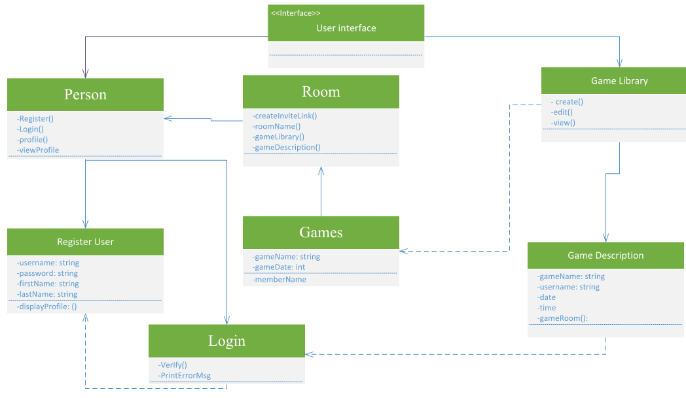

## 1.	Introduction:
TableTalk a collaboration tool for organizing board game nights with other people. It could be for personal or business use, as many game stores love to host tournaments or other get-togethers. The website would link with the BoardgameAtlas Api (Links to an external site.) which is a REST API which would allows for the integration of search features for boardgame rules and pictures so that users could make lobbies based on the game(s) they have and/or want to play.

## 2.	Storyboard:

Start Page

Log In Page

Start Page after logging in

Create New Room

Join Game

Time Selector

Overall View of Storyboard 

## 3.	Functional Requirements:

1. 
o As a User

o I want to log in

o So that I can use the app.

Given a username and password field

When I enter valid credentials

Then I should be logged in

-or-

Given a username and password field

When I enter invalid credentials

Then I should be notified of the incorrect credentials

2.

o As a user

o I want to search for games

o So that I can find the game I want to play

Given a search field

When I type in the name of a game

Then I should be shown the correct game

-or-

Given a search field

When I type in the name of an unknown game

Then I should be shown a “Game Not Found” screen

3.

o As a user

o I want to add friends

o So that I can interact with them

Given an “add” button on other people’s profiles

When I tap the button

Then it should send an invite to them to be friends

4.

o As a user

o I want to create groups of friends (rooms)

o So that I can plan group events

Given a screen for rooms

When I tap “Create Room” button

Then I should create a room and add friends to it

-or-

Given a list of friends

When I tap “Add to room” button on friend’s profile

Then I should choose from my list of rooms or create a new room to add my friend to

   
## 4.	Class Diagram: 

o	UML-based class diagram.

o	Class Diagram Description: One or two lines for each class to describe use of interfaces,  classes and resources, interfaces, etc. Don't worry about putting 
more than a few words to each class; this does not need to be thorough.

## 5.	JSON Schema: 

o	 Your project should have an REST endpoint that emits JSON, which another group can consume.  The design document should contain a draft JSON schema for this endpoint. 

  You can create a schema from a Java class at QuickType.io.  This Java class is typically a DTO.  That's all you need at this point.

{
"Room":[

{

"createInviteLink": "The user will be able to create a link which they can use to invite friends",

"Roomname": "Friends can find your room using the name if they don't have a link",

"Gamelibrary": "have  the games that you can choose from",

"gameDescrption": " What the game is about who created the room"

},

{

"Person":[
{

"Register()": "user doesn't have an account need to register",

"Login()": "after registering users can login",

"Profile()": "users can have acces to their profile ",

"viewProfile": " they can have a viewprofile where they can change name"
},
{

"Register User":[
{

"firstName": "user registering entering the firstname",

"lastName": "user registering entering the lastname",

"userName": " users also have to create a username that they can use to login",

"password": " password for authentication",

"displayProfile": " Displaying the user profile"
},
{
"Login":[
{

"Verify()":"Make sure that the user authentications are correct",

"printErrorMessage":" send error message if authentication is wrong"
},
{
"Games":[
{

"gameName": "have a game name when created",

"gameDate": "date is needed for games"
},
{
"GameListing":[
{

"Create()":" have to create a room",

"Edit": "user can also edit the room",

"View":"users can see the room they created"
},
{
"GameDescription":[
{

"gameName()":"when someone else is looking at the room",

"username":"need to know who created the room",

"date": "date of the game",

"time": "time of the game",

"gameRoom":"name of gameroom"
}]
}]
}]   
}]    
}]
}]

}]}
 
## 6.	Scrum Roles:

UI Specialist: Luke Greeley

Business Logic Specialists: Storm Hamilton & Mamadou Kone

Scrum Master: Anne Catherwood

## 7.	GitHub Project Link:

[Repository](https://github.com/hamilsu/TableTalk)

## 8.	 Scrum Board (AKA Github Projects):
[Project Board](https://github.com/discospiff/SpringBootMicroservicesWithIntelliJIDEA/milestone/1)

## 9) Standup Time and Link:  
[Wednesdays @ 8:30 on Teams](https://teams.microsoft.com/l/meetup-join/19%3ameeting_OThiNzkzYTgtYzAzMi00YzBkLTk2ZWUtYzMyYjFjYmRkNDM2%40thread.v2/0?context=%7b%22Tid%22%3a%22f5222e6c-5fc6-48eb-8f03-73db18203b63%22%2c%22Oid%22%3a%220a98679a-f018-43b0-b7ad-e6cb6d74f56d%22%7d) 

